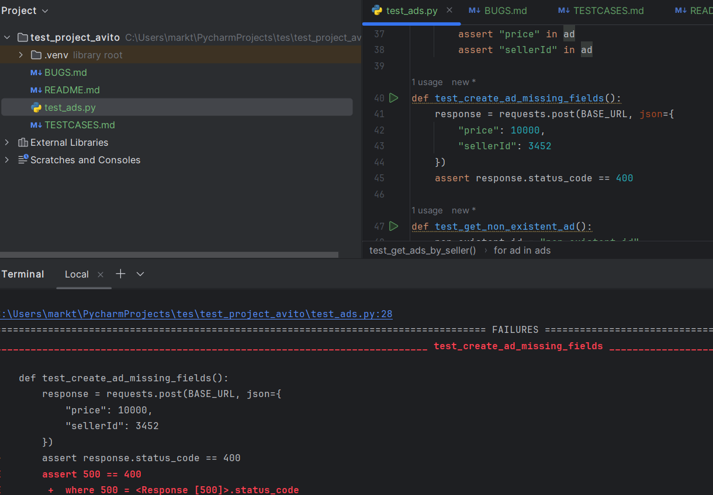
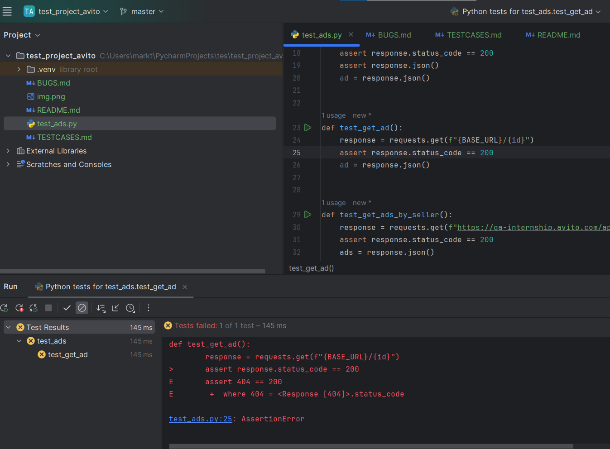

Баг-репорты

Баг№ 1: Неверный ответ при создании объявления
Описание: При создании объявления ответ содержит неверный статус:
Шаги воспроизведения: Отправить POST запрос на создание объявления без поля "name".
Ожидаемый результат: Статус 201 (created).
Фактический результат: Статус 200(OK).
Окружение: Windows 11 Pro v.22H2, Google Chrome v.119.0.6045.200, 1920x1080
Серьезность/Приоритет: trivial/low
Комментарии: Ошибка тривиальная так как всё проходит успешно

Баг№ 2: Ошибка при создании объявления с отсутствующими обязательными полями
Описание: При попытке создать объявление без обязательных полей возвращается статус 500.
Шаги для воспроизведения:
Отправить POST запрос на создание объявления без поля "name".
Ожидаемый результат: Статус 400 (Bad Request).
Фактический результат: Статус 500 .

Окружение: Windows 11 Pro v.22H2, Google Chrome v.119.0.6045.200, 1920x1080
Серьезность/Приоритет: Minor/medium
Комментарии: требует внимания потому что отображается как ошибка на сервере, а это всегда тревожный звоночек.

Баг№ 3: Ошибка клиента при запросе созданого объявления
Описание: Выдает 404 ошибку при get запросе корректного id объявления:
Предусловие: Создан пользователь, скопирован его уникальный индетификатор
Шаги воспроизведения: Отправить GET запрос на запрос объявления .
Ожидаемый результат: Статус 200 (OK).
Фактический результат: Статус 404.
Окружение: Windows 11 Pro v.22H2, Google Chrome v.119.0.6045.200, 1920x1080
Серьезность/Приоритет: Critical/high
Комментарии:Ошибка критическая так как это основной функционал, прописанный в требованиях.
PS Возможно я что-то делаю не так, потому что в постмане ошибки нет

